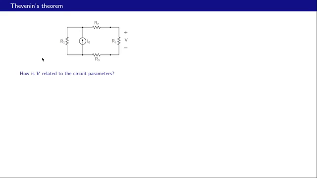
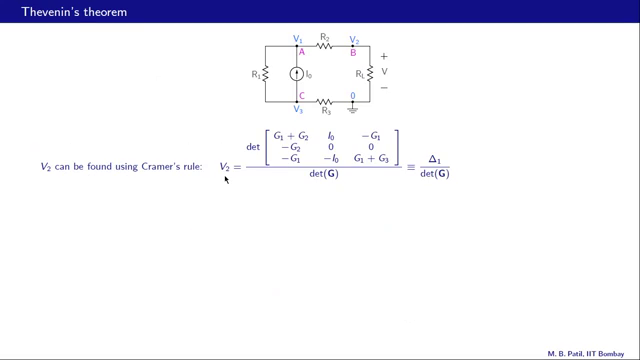
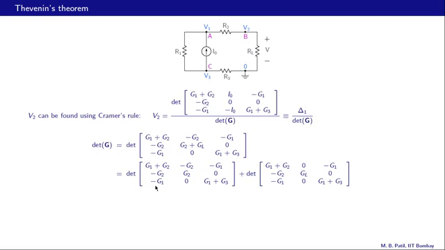
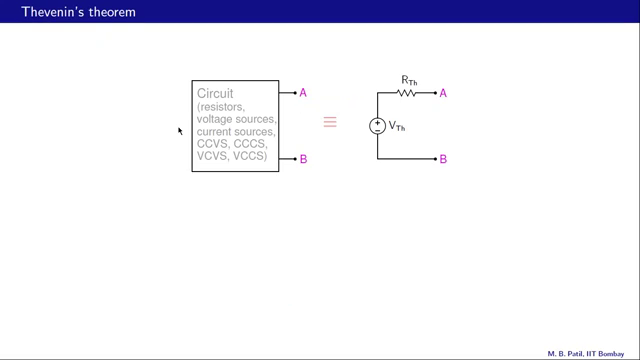
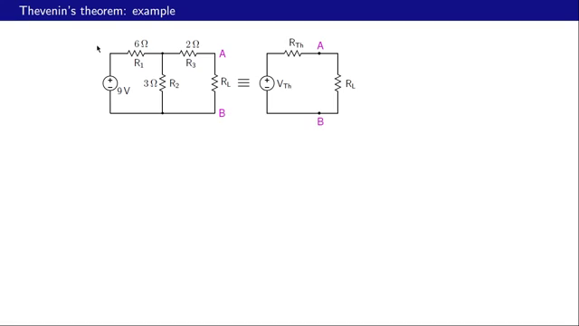
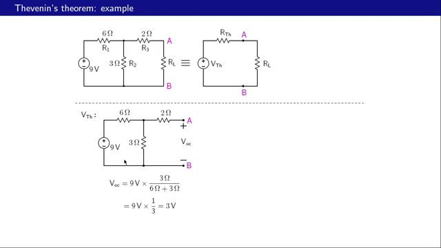
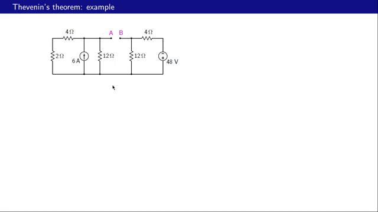
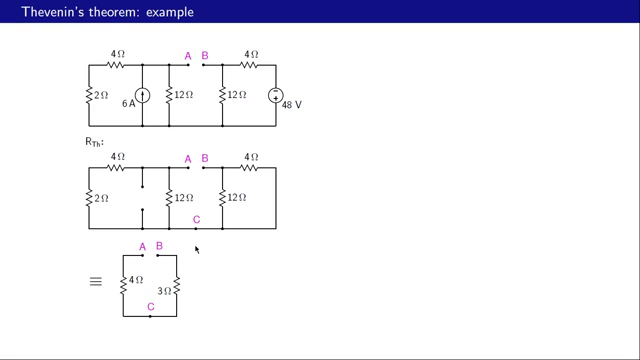
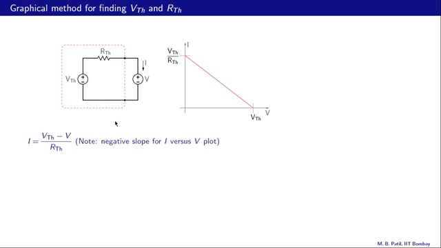
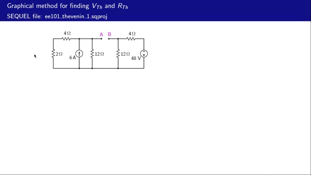

# Basic Electronics - Thevenin's Theorem

## Introduction to Thevenin's Theorem

Thevenin's theorem is a fundamental concept in electronics that allows us to represent a complex circuit with a simpler equivalent form. To understand why this is possible, let's consider a circuit with a load resistor RL, where we're interested in finding the voltage across RL. In essence, we want to determine how this voltage, denoted as V, relates to the circuit parameters.

To begin, we assign node voltages to various points in the circuit with respect to a reference node. Let's denote the voltage at node A as V1, the voltage at node B as V2, and the voltage at node C as V3. By applying Kirchhoff's Current Law (KCL) at each node, we can write equations in terms of these node voltages. For instance, at node A, we have three currents: one leaving the node through R1, one through R2, and an external current I0 entering the node. We define conductances G1, G2, etc., as the reciprocals of the corresponding resistances, i.e., G1 = 1/R1, G2 = 1/R2, and so on.

Using these definitions, we can express the KCL equation at node A as G1(V1 - V3) + G2(V1 - V2) - I0 = 0. Similarly, we can write KCL equations for nodes B and C, resulting in a system of linear equations. By arranging these equations in a matrix form, we obtain a 3x3 matrix equation, where the matrix G represents the conductances between nodes, V is the column vector of node voltages, and Is is the source current vector.

Our objective is to find a relationship between V and the rest of the circuit. To do this, we need to solve the matrix equation G * V = Is for the node voltage V2, which is equivalent to the voltage V across the load resistor RL. One way to achieve this is by using Kramer's rule, which states that V2 can be found by taking the ratio of two determinants: D1, the determinant of the matrix G with the second column replaced by the RHS vector, and D2, the determinant of the original matrix G.

By simplifying the expression obtained from Kramer's rule, we can establish a relationship between V and the circuit parameters. This relationship will allow us to represent the complex circuit with a simpler Thevenin equivalent form, which consists of a single voltage source and a series resistance. In the next steps, we will explore how to extract the Thevenin parameters and apply them to simplify the analysis of electronic circuits.

**Diagrams/board content from this segment:**

*~ NPTEL (captured at 5.0s)*

*BASIC ELECTRONICS mst - (captured at 10.0s)*

*The, Re Oe R ‘ oN How is V related tothe circuit parameters? (captured at 60.0s)*

---

## Deriving the Thevenin Equivalent Circuit

To find the voltage $V_2$, we apply Cramer's rule, which states that $V_2$ is given by the ratio of two determinants: the determinant of the original $G$ matrix with the second column replaced with the RHS vector, and the determinant of the $G$ matrix itself. Let's denote the first determinant as $\delta_1$ and the second as $\delta$. Notice that $\delta_1$ does not depend on the load resistance $RL$ or $GL$, making its value independent of the load resistance.

The determinant of the $G$ matrix, $\delta$, does depend on $GL$. To simplify this, we can express one of the columns in the $G$ matrix as the sum of two columns, allowing us to write the determinant $\delta$ as the sum of two determinants. One of these determinants, denoted as $\delta$, has no $GL$ term, while the other, $GL$ times $\delta_2$, does contain $GL$. By making this substitution, we can express $V_2$ as $\delta_1$ divided by $\delta + GL\delta_2$. The key point here is that $\delta_1$, $\delta$, and $\delta_2$ are all independent of $GL$.

The only dependence of $V_2$ on $GL$ is through the term $GL\delta_2$ in the denominator. To further simplify the expression for $V_2$, we notice that $\delta_2/\delta$ has units of resistance. Therefore, we define the Thevenin resistance $R_{Thevenin}$ as $\delta_2/\delta$. With this definition, the expression for $V_2$ simplifies to $V_2 = RL/(RL + R_{Thevenin}) \cdot V_{2_{OC}}$, where $V_{2_{OC}}$ is the open-circuit value of $V_2$, obtained by letting $RL$ approach infinity (or equivalently, $GL$ approach 0).

This expression for $V_2$ closely resembles the voltage division formula. In fact, it corresponds to a circuit where $V_{2_{OC}}$ is the voltage source, $R_{Thevenin}$ and $RL$ are in series, and $V_2$ is the voltage across $RL$. This realization allows us to replace the original circuit with a simpler, equivalent circuit known as the Thevenin equivalent circuit. The Thevenin equivalent circuit consists of a voltage source $V_{Thevenin} = V_{2_{OC}}$ in series with the Thevenin resistance $R_{Thevenin}$, which simplifies the analysis of the circuit by reducing it to a single voltage source and series resistance. This simplification is a powerful tool for analyzing complex circuits and understanding how they behave under different conditions.

**Diagrams/board content from this segment:**

*Thevenin Ri 5 Rev Ve can be found using Cramer's rule: Ve = (captured at 370.0s)*

*az Ov nev Va can be found using Cramer's rule: Ve = Gs dex(6 (captured at 445.0s)*

---

## Thevenin's Theorem and Its Application

Thevenin's theorem allows us to replace a complex circuit with a simpler equivalent circuit, consisting of a single voltage source in series with a resistance. This equivalent circuit, known as the Thevenin equivalent circuit, can be used to simplify the analysis of complex circuits. The voltage source in the Thevenin equivalent circuit is called the Thevenin voltage, or VTH, and the resistance is called the Thevenin resistance, or RTH. 

To apply Thevenin's theorem, we can use it to represent any circuit consisting of resistors, independent voltage sources, independent current sources, and dependent sources, such as current-controlled voltage sources or current-controlled current sources. By doing so, we can simplify the analysis of the circuit by replacing it with its Thevenin equivalent. When a load resistance, RL, is connected between two points, A and B, in both the original circuit and its Thevenin equivalent, the voltage across the load resistance and the current through it will be identical in both cases.

To find VTH, we can use the fact that the open-circuit voltage between A and B in both the original circuit and its Thevenin equivalent must be the same. By measuring the open-circuit voltage, VOC, between A and B in the original circuit, we can determine VTH, as it is equal to VOC. On the other hand, finding RTH can be done through several methods. One approach is to deactivate all independent sources in the original circuit and then find the resistance between A and B. This resistance will be equal to RTH. Often, RTH can be found by inspection of the original circuit with the independent sources deactivated. If not, a test source, either a voltage source or a current source, can be used to find RTH. For example, if a test voltage source, VS, is used, we can find the current, IS, and then calculate RTH as VS divided by IS.

Another method to find RTH involves using the open-circuit voltage and the short-circuit current. By finding VOC and ISC in both the original circuit and its Thevenin equivalent, we can use the fact that these values must be the same in both cases to determine RTH. The relationship between VOC, ISC, and RTH can be used to calculate RTH, providing an alternative approach to finding the Thevenin resistance. By applying Thevenin's theorem and using these methods to find VTH and RTH, we can simplify the analysis of complex circuits and make it easier to understand their behavior.

**Diagrams/board content from this segment:**

*Rr Circuit A A (resistors, ‘ sources, Vm Cevs, Coes, vevs, v (captured at 765.0s)*

---

## Determining Thevenin Equivalent Circuits

To find the Thevenin equivalent of a circuit, we need to determine two key components: the Thevenin voltage (VTH) and the Thevenin resistance (RTH). The Thevenin voltage is equivalent to the open-circuit voltage (VOC) between the two points of interest, in this case, points A and B. When the circuit is open-circuited, meaning no load is connected across points A and B, the voltage measured between these points is the Thevenin voltage. This is because, in the Thevenin representation, there is no voltage drop across RTH when the circuit is open-circuited, making VOC equal to VTH.

The short-circuit current (ISC) is another crucial component in finding RTH. ISC is the current that flows between points A and B when they are directly connected, or short-circuited. Since there's no other resistance in the circuit when A and B are short-circuited, ISC is simply VTH divided by RTH. Knowing that VTH equals VOC, we can say that ISC equals VOC divided by RTH. This relationship gives us a formula to calculate RTH: RTH equals VOC divided by ISC. It's essential to note that in finding VOC and ISC for the purpose of calculating RTH, the independent sources in the original circuit are not deactivated. This approach simplifies the process by allowing us to work directly with the original circuit's configuration.

Let's consider an example to illustrate this concept. Suppose we have a circuit with a voltage source and resistors, and we want to find its Thevenin equivalent as seen from points A and B. To find VTH, we remove the load (in this case, RL) and calculate the open-circuit voltage between A and B. This can often be done using voltage division. For instance, if we have a voltage source of 9 volts and the resistors are configured such that the voltage division gives us 3 volts, then VTH (or VOC) is 3 volts.

To find RTH, we deactivate the independent sources and look at the resistance from points A and B. Deactivating a voltage source means replacing it with a short circuit, and deactivating a current source means replacing it with an open circuit. We then calculate the equivalent resistance seen from points A and B. This might involve combining resistors in series and parallel. In one example, after deactivating the sources, we might find that the resistance from A to B includes resistors in parallel and series, which can be simplified to a single equivalent resistance, let's say 4 ohms.

For a slightly more complex example, consider a circuit with two independent sources: a current source of 6 amperes and a voltage source of 48 volts. To find the Thevenin equivalent as seen from points A and B, we first find RTH by deactivating the sources and calculating the resistance between A and B. The current source is replaced with an open circuit, and the voltage source is replaced with a short circuit. The resistors are then combined in series and parallel to find the total resistance from A to B, which could be, for example, 7 ohms.

Finding VTH involves calculating the open-circuit voltage between A and B. This can be more complicated in the presence of multiple sources but involves using principles like the current divider rule or voltage divider rule, depending on the circuit configuration. In some cases, it's helpful to break down the circuit into parts to analyze the voltage drops across different components. By carefully applying circuit analysis principles, we can determine VTH and thus complete the Thevenin equivalent circuit. 

In essence, determining the Thevenin equivalent of a circuit involves understanding the relationships between VOC, ISC, VTH, and RTH and applying circuit analysis techniques to find these values. It's a powerful method for simplifying complex circuits into more manageable forms, facilitating easier analysis and calculation of circuit behaviors under various conditions.

**Diagrams/board content from this segment:**

*Rn R OV, R (captured at 1175.0s)*

*rem: exampli so an Boy ts i R= Ovn Dy 3FR oy 8 Vn: 62 20 3A  (captured at 1225.0s)*

*4a. 20, on 20 20 (captured at 1290.0s)*

*Thev rem: a0 AB 40 20, ro 30 on Rov a2 AB 40 201 ne gre AB 4 (captured at 1335.0s)*

---

## Finding Thevenin's Voltage and Resistance Using Graphical Methods

To determine Thevenin's voltage (VTH) and resistance (RTH) graphically, we can utilize a method involving voltage division and a plot of current versus voltage. Let's begin with the given circuit, where VCB is determined by voltage division of 48 volts between 12 ohms and 4 ohms, resulting in 36 volts. Consequently, the total voltage between points A and B is the sum of VAC (24 volts) and VCB (36 volts), which equals 60 volts. This total voltage is equivalent to VTH, and with RTH calculated as 7 ohms, we establish the Thevenin equivalent circuit.

The graphical approach for finding VTH and RTH involves connecting a voltage source between points A and B in the circuit and then plotting the current as a function of the voltage. The plot obtained has a negative slope, given by the equation I = (VTH - V) / RTH, where the slope of the line is -1/RTH. The x-intercept of this line corresponds to VTH (or VOC, the open-circuit voltage), while the y-intercept represents the short-circuit current (ISC), which is VTH/RTH. By analyzing this plot, we can directly determine VTH and RTH.

Applying this graphical method to a circuit involves connecting a voltage source between the points of interest (A and B) and measuring the current for various voltages. The resulting plot of current versus voltage allows us to find VTH as the intercept on the voltage axis and ISC (which equals VTH/RTH) as the intercept on the current axis. This approach provides a straightforward method for determining Thevenin's voltage and resistance.

An alternative to using a voltage source is to connect a resistor load (R) between points A and B and then measure the current for different resistance values. By plotting current versus voltage, we would obtain a similar plot, enabling us to find VTH and RTH. This flexibility in methodology underscores the utility of Thevenin's theorem in circuit analysis.

Through this graphical method, we can determine VTH and RTH for a given circuit, which are essential parameters for understanding circuit behavior under various conditions. The application of Thevenin's theorem, facilitated by graphical analysis, enhances our ability to simplify complex circuits and predict their performance, making it a fundamental tool in circuit analysis and design.

**Diagrams/board content from this segment:**

*for finding Bo Vn, vn Ov ‘ Vn = v 1= ~T— (Note: negative slo (captured at 1505.0s)*

*49 40 20 4 120 20 © 8 (captured at 1660.0s)*
